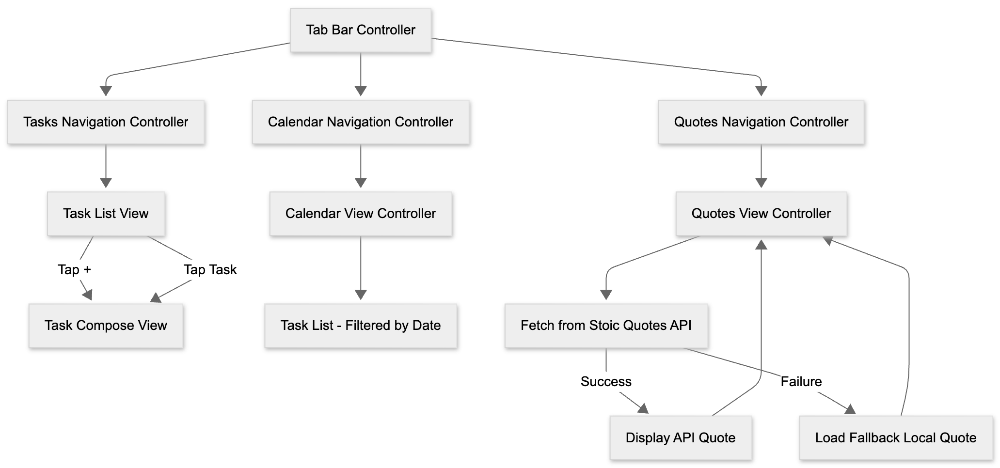

# 🧘🏻‍♂️ TaskStoic 

Introducing **TaskStoic**, where planning, productivity, and reflection come together effortlessly. It brings tasks, calendar viewing, and daily Stoic insights into one unified experience.

# 🖥️ Demo

<div>
    <a href="https://www.loom.com/share/efdabb2b61e34c9d84ea7f0ba3c065ff"></a>
    <a href="https://www.loom.com/share/efdabb2b61e34c9d84ea7f0ba3c065ff">
      
    </a>
</div>

# ✨ Features

### Powerful Task Management, Made Effortless

- [x] **Smart Task Actions:** Add, edit, and delete tasks in seconds
- [x] **Minimalist Task Cells:** Clean layout with title, optional note, and a one-tap completion toggle
- [x] **Auto-Organized:** Incomplete tasks rise to the top and completed tasks neatly move to the bottom
- [x] **Persistent Memory:** Your tasks stay saved automatically with ultra-reliable on-device storage

Stay focused. Stay disciplined. Stay Stoic.

### Your Schedule, Visualized with Clarity

- [x] **Intuitive Daily Planning:** Tap any date to instantly view all tasks due that day
- [x] **Effortless Management:** Swipe to delete tasks directly from the calendar view
- [x] **Smart Visual Indicators:**
  - [x] Hollow circle → one or more tasks still incomplete
  - [x] Filled circle → all tasks for that day completed
- [x] **Fluid Synchronization:** Changes update seamlessly across tabs — no refresh needed
- [x] **Adaptive Layout:** Auto Layout ensures the calendar fits naturally on every device size

TaskStoic transforms your monthly overview into a calm, organized experience.

### Daily Wisdom, Thoughtfully Presented

- [x] **Live Quotes:** Fetches meaningful insights from the Stoic Quotes API
- [x] **Offline Reliability:** Automatically switches to curated local quotes if the network is unavailable
- [x] **Interactive Refresh:** Tap to reveal a new quote instantly
- [x] **Tactile Feedback:** Subtle haptics and a gentle bounce animation elevate every interaction
- [x] **Auto-Refresh:** A fresh quote awaits each time you return to the tab
- [x] **Premium Typography:** Styled with attributed strings for a refined, readable presentation
- [x] **Smooth Fade-In:** Each quote appears with a clean, calming animation

A serene space for reflection, designed to bring clarity and calm into your day.

# 🧩 Architecture

TaskStoic’s codebase is organized into focused, single-purpose files that mirror the app’s clean and modular design. Each view controller handles one core feature, making the project easy to understand, extend, and maintain.

### Flowchart

<p align="center">
  
</p>

### Source Files

- TaskListViewController.swift — main task list logic
- TaskComposeViewController.swift — creating & editing tasks
- CalendarViewController.swift — calendar view, filtering, decorations
- QuotesViewController.swift — quotes API, fallback, styling, animations
- Task.swift — Task model + JSON persistence
- TaskCell.swift — custom task row

# 💻 Tech Stack

Swift, UIKit, Auto Layout, UserDefaults, UICalendarView, URLSession, Haptics, Attributed Strings

# 📦 Installation

Requirements:
- Xcode 14 or later
- iOS 16+ (required for UICalendarView)
- macOS 12.5 or later

Clone the repository:
```
git clone https://github.com/compscibro/TaskStoic.git
```

Open:
```
open the .xcodeproj file
```

Run on:
- iPhone Simulator
- Physical device (with signing)

# 🚦 Roadmap

**Next**
- [ ] Reorder tasks directly from the Tasks tab 

**Coming Soon**
- [ ] Task notifications  
- [ ] Scheduled reminders with a Stoic quote  
- [ ] Expanded Stoic quote library  
- [ ] Show the selected date in the Tasks tab 

**Future Vision**
- [ ] iCloud sync across all devices  
- [ ] Task categories for deeper organization  
- [ ] Sort tasks by category  
- [ ] Custom colors for categories  
- [ ] Visual insights for completed vs. remaining tasks  
- [ ] New “Achievements” tab with badges for reaching milestones 

# 📄 License

TaskStoic is open-source and available under the **CC BY-NC 4.0 License**.  
You are free to view, use, and contribute to the project, but **commercial use is strictly prohibited** without written permission.

Full license: https://creativecommons.org/licenses/by-nc/4.0/